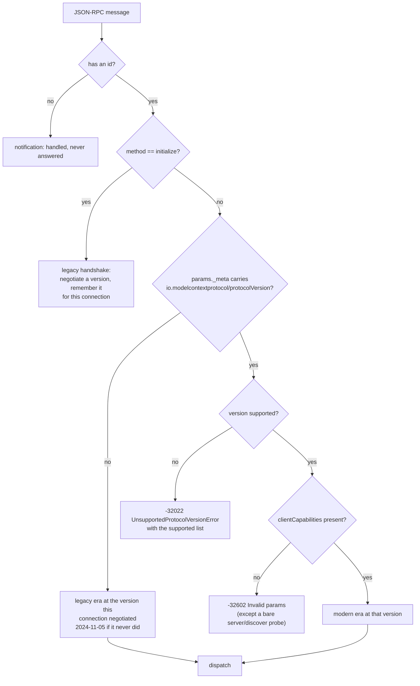

# Protocol Behaviour

`caged-mcp` is a **dual-era** Model Context Protocol server. It serves
revision `2026-07-28` (current stable, stateless) and the handshake-based
revisions `2025-11-25` and `2024-11-05` on the same process and the same
connection, and the client's own first message decides which it gets.

This is the shape the specification's own compatibility matrix calls out as
working with every client era that exists: *Dual-era / Modern → works,
Legacy / Dual-era → works.*

## How a request picks its era



The era is a property of the message, not of the server, and never of
configuration. There is no flag to set.

## What each era sees

| | `2024-11-05` | `2025-11-25` | `2026-07-28` |
|---|---|---|---|
| Opens with | `initialize` | `initialize` | nothing — every request is self-describing |
| `resultType` on results | no | no | `"complete"` |
| `ttlMs` / `cacheScope` on `tools/list` | no | no | yes (`3600000`, `public`) |
| `_meta.io.modelcontextprotocol/serverInfo` | no | no | yes |
| `outputSchema` / `structuredContent` | no | yes | yes |
| `server/discover` | answered | answered | answered |
| `ping` | answered | answered | answered (see below) |

A `2024-11-05` session's responses are byte-identical to the ones this
server produced before it became dual-era. That is pinned by
`TestLegacyResponsesAreUnchanged`.

## Legacy version negotiation

`initialize` gets the client's own version when this server supports it, and
otherwise the newest supported revision **no newer** than the one it asked
for — never something newer, which the client may not understand.

| Client asks for | Server answers |
|---|---|
| `2026-07-28` | `2025-11-25` |
| `2025-11-25` | `2025-11-25` |
| `2025-06-18` | `2024-11-05` |
| `2025-03-26` | `2024-11-05` |
| `2024-11-05` | `2024-11-05` |
| nothing | `2024-11-05` |

## Deliberate departures from `2026-07-28`

Three, each because the alternative is worse for a real user:

1. **`ping` is still answered in the modern era**, though the revision
   removes it. Clients send it as a keepalive regardless of revision;
   returning "method not found" would drop a working connection for nothing.
2. **A `server/discover` carrying no `_meta` at all is answered** rather
   than rejected as malformed. That shape is an era probe, and refusing it
   would hide the version list the client is asking for. Every other request
   missing a required `_meta` field is rejected with `-32602`.
3. **WebSocket is offered as a transport**, and it is not one: the
   specification defines stdio and Streamable HTTP. WebSocket is what the
   Caged platform endpoint uses and what this binary has always offered, so
   it stays. stdio — what every editor configuration in the README uses — is
   conformant.

## Not implemented

`resources/*`, `prompts/*`, `subscriptions/listen`, Multi Round-Trip
Requests, pagination of `tools/list`, and Streamable HTTP with its
`Mcp-Method` / `Mcp-Name` header routing. No tool here asks the client a
question, so no result is ever `input_required`; the `tools/list` result is
small enough that a cursor would be ceremony.

## Driving it by hand

```bash
# Modern: no handshake at all.
printf '%s\n' '{"jsonrpc":"2.0","id":1,"method":"server/discover","params":{"_meta":{"io.modelcontextprotocol/protocolVersion":"2026-07-28","io.modelcontextprotocol/clientCapabilities":{}}}}' \
  | caged-mcp --mode stdio --workspace .

# Legacy: the handshake, and note the negotiated version in the reply.
printf '%s\n' '{"jsonrpc":"2.0","id":1,"method":"initialize","params":{"protocolVersion":"2024-11-05","capabilities":{}}}' \
  | caged-mcp --mode stdio --workspace .
```

The supported revisions are also logged at startup, so the running process
reports its own protocol currency rather than leaving it to be inferred:

```json
{"level":"INFO","msg":"protocol versions","supported":["2026-07-28","2025-11-25","2024-11-05"]}
```
